# C4 Level 3 — Component Diagram: recon-service API

```mermaid
C4Component
    title C4 Component - recon-service API

    Container_Ext(spa, "SPA Frontend", "React / Vite", "Single-page app consumed by Ops Analysts and Managers")
    ContainerDb_Ext(postgres, "PostgreSQL", "PostgreSQL 15", "Stores trades, breaks, audit logs, and reference data")
    Container_Ext(kafka, "Apache Kafka", "Kafka 3.x", "Message broker for trade events and alerts")
    Container_Ext(sso, "Identity Provider", "OIDC / SSO", "Issues and validates JWT access tokens")
    Container_Ext(prometheus, "Prometheus", "Metrics collector", "Scrapes actuator prometheus endpoint")

    Container_Boundary(api, "recon-service API (Spring Boot)") {

        Component(securityFilter, "JwtSecurityFilter", "Spring Security Filter", "Intercepts requests and validates JWT tokens")

        Component(authController, "AuthController", "REST Controller", "Handles login, token refresh, logout")
        Component(tradeController, "TradeController", "REST Controller", "Handles trade CRUD, search, pagination")
        Component(reconController, "ReconController", "REST Controller", "Handles breaks listing, disposition updates")
        Component(auditController, "AuditController", "REST Controller", "Handles audit log queries and exports")

        Component(tradeService, "TradeService", "Spring Service", "Trade lifecycle: create, update, validate, cancel")
        Component(reconEngine, "ReconciliationEngine", "Spring Service", "Compares internal vs external trades, flags breaks")
        Component(analyticsService, "TradeAnalyticsService", "Spring Service", "Aggregates KPIs: break counts, ageing, resolution")
        Component(instrumentService, "InstrumentService", "Spring Service", "Instrument reference data lookups and caching")

        Component(tradeRepo, "TradeRepository", "Spring Data JPA", "Persists and queries Trade entities")
        Component(breakRepo, "ReconBreakRepository", "Spring Data JPA", "Persists reconciliation breaks")
        Component(auditRepo, "AuditLogRepository", "Spring Data JPA", "Stores immutable audit trail records")

        Component(tradeProducer, "TradeEventProducer", "Kafka Producer", "Publishes trade events to Kafka")
        Component(reconConsumer, "ReconciliationConsumer", "Kafka Consumer", "Subscribes to recon-request topic")
        Component(eventConsumer, "EventConsumer", "Kafka Consumer", "Consumes alert and audit events")
    }

    Rel(spa, securityFilter, "Sends authenticated requests", "HTTPS")

    Rel(securityFilter, sso, "Validates JWT signature", "HTTPS")
    Rel(securityFilter, authController, "Routes auth requests")
    Rel(securityFilter, tradeController, "Routes trade requests")
    Rel(securityFilter, reconController, "Routes recon requests")
    Rel(securityFilter, auditController, "Routes audit requests")

    Rel(tradeController, tradeService, "Invokes trade operations")
    Rel(reconController, reconEngine, "Triggers reconciliation runs")
    Rel(reconController, analyticsService, "Fetches KPI dashboards")
    Rel(auditController, auditRepo, "Queries audit logs")

    Rel(tradeService, tradeRepo, "Reads and writes trades", "JPA")
    Rel(tradeService, instrumentService, "Resolves instrument codes")
    Rel(reconEngine, tradeRepo, "Loads trades for matching", "JPA")
    Rel(reconEngine, breakRepo, "Persists detected breaks", "JPA")
    Rel(analyticsService, breakRepo, "Aggregates break statistics", "JPA")

    Rel(tradeRepo, postgres, "Persists trade records", "JDBC")
    Rel(breakRepo, postgres, "Persists break records", "JDBC")
    Rel(auditRepo, postgres, "Persists audit events", "JDBC")

    Rel(tradeService, tradeProducer, "Emits trade lifecycle events")
    Rel(tradeProducer, kafka, "Publishes events", "Kafka")
    Rel(reconEngine, tradeProducer, "Emits recon-complete events")

    Rel(kafka, reconConsumer, "Subscribes to topics", "Kafka")
    Rel(kafka, eventConsumer, "Subscribes to topics", "Kafka")
    Rel(reconConsumer, reconEngine, "Triggers reconciliation")
    Rel(eventConsumer, auditRepo, "Persists audit events")

    Rel(prometheus, securityFilter, "Scrapes metrics endpoint", "HTTP")

    UpdateLayoutConfig($c4ShapeInRow="4", $c4BoundaryInRow="1")
```

## Component Summary

| Stereotype | Component | Responsibility |
|------------|-----------|----------------|
| **Security** | JwtSecurityFilter | Intercepts HTTP requests; validates JWT tokens against Identity Provider |
| **Controller** | AuthController | Login, token refresh, logout endpoints |
| **Controller** | TradeController | Trade CRUD, search, pagination |
| **Controller** | ReconController | Break listing, disposition updates, recon triggers |
| **Controller** | AuditController | Audit log queries and CSV/JSON exports |
| **Service** | TradeService | Trade lifecycle business logic |
| **Service** | ReconciliationEngine | Core matching algorithm; detects mismatches |
| **Service** | TradeAnalyticsService | KPI aggregation (break counts, ageing, resolution rates) |
| **Service** | InstrumentService | Instrument reference data lookups with caching |
| **Repository** | TradeRepository | JPA repository for Trade entity |
| **Repository** | ReconBreakRepository | JPA repository for ReconBreak entity |
| **Repository** | AuditLogRepository | JPA repository for AuditLog entity |
| **Kafka** | TradeEventProducer | Publishes trade-created / trade-updated events |
| **Kafka** | ReconciliationConsumer | Listens for recon-request messages |
| **Kafka** | EventConsumer | Listens for alert and audit events |

## Design Notes

1. **Security-first flow** — Every inbound request passes through `JwtSecurityFilter` before reaching any controller.
2. **Event-driven reconciliation** — `ReconciliationConsumer` decouples recon triggers from synchronous HTTP calls, enabling batch and scheduled runs.
3. **Audit trail immutability** — `AuditLogRepository` writes append-only records; no updates or deletes exposed.
4. **Observability** — Spring Actuator exposes `/actuator/prometheus` endpoint scraped by Prometheus for metrics.
