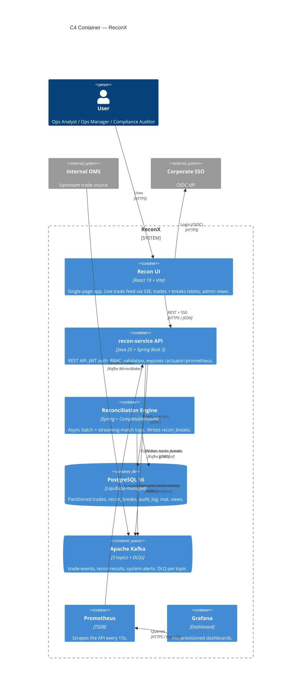

# C4 Level 2 — Container Diagram: ReconX

## Container Summary

| Type | Container | Technology | Responsibility |
|------|-----------|------------|----------------|
| **Frontend** | Recon UI | React 19 + Vite | Single-page app; live trade feed via SSE; trades, breaks, and admin views |
| **API** | recon-service API | Java 25 + Spring Boot 3 | REST API; JWT auth, RBAC, validation; exposes `/actuator/prometheus` |
| **Service** | Reconciliation Engine | Spring + CompletableFuture | Async batch and streaming match logic; writes `recon_breaks` |
| **Database** | PostgreSQL 16 | Liquibase-managed | Partitioned trades, recon_breaks, audit_log, materialised views |
| **Queue** | Apache Kafka | 3 topics + DLQs | `trade-events`, `recon-results`, `system-alerts`; DLQ per topic |
| **Monitoring** | Prometheus | TSDB | Scrapes the API every 15 s |
| **Monitoring** | Grafana | Dashboard | Pre-provisioned dashboards for platform health and KPIs |

## Design Notes

1. **SSE for live data** — The React SPA receives real-time trade updates from the API via Server-Sent Events, avoiding polling overhead.
2. **Event-driven reconciliation** — Kafka decouples trade ingestion from the reconciliation engine, enabling async batch and streaming processing.
3. **Dead-letter queues** — Each Kafka topic has a paired DLQ to capture unprocessable messages without blocking the main consumer.
4. **Observability** — Prometheus scrapes the Spring Actuator endpoint; Grafana provides pre-provisioned dashboards sourced from the `monitoring/` directory.
5. **External identity** — The SPA delegates authentication to the Corporate SSO (OIDC), keeping credential management outside the platform boundary.
