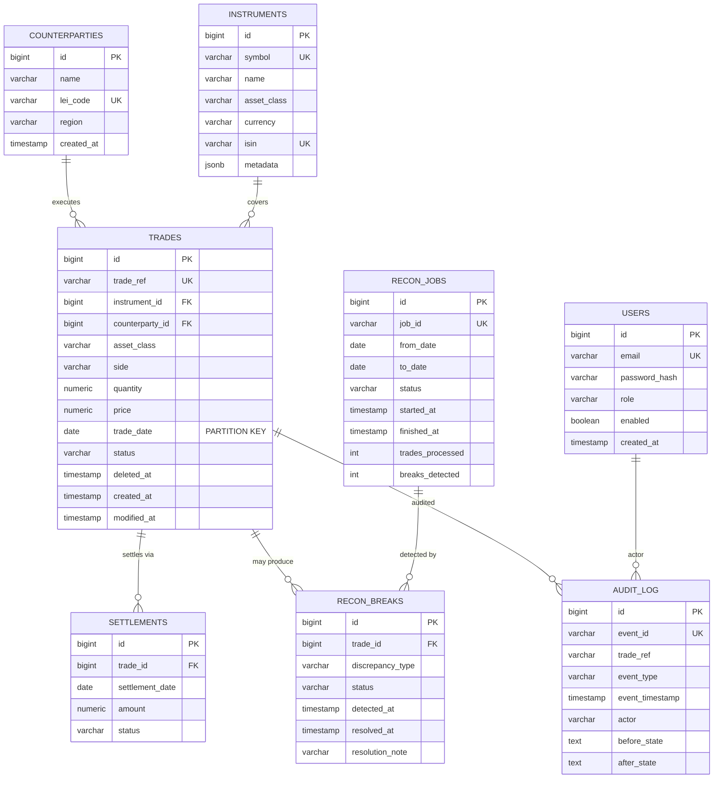

# TICKET-ADV006 - ER Model (8 Entities)

## Entity Summary

| Entity | Purpose | Partition Key |
|--------|---------|---------------|
| **counterparties** | Trading counterparties with LEI codes | - |
| **instruments** | Financial instruments (equities, bonds, etc.) | - |
| **trades** | Core trade records with lifecycle status | `trade_date` |
| **settlements** | Settlement instructions per trade | - |
| **recon_breaks** | Detected discrepancies during reconciliation | - |
| **recon_jobs** | Async reconciliation job tracking | - |
| **audit_log** | Append-only event log for trade changes | - |
| **users** | Application users for JWT-based RBAC | - |

## Foreign Key Relationships

| Child Table | FK Column | Parent Table | Constraint |
|-------------|-----------|--------------|------------|
| trades | instrument_id | instruments | fk_trades_instrument |
| trades | counterparty_id | counterparties | fk_trades_counterparty |
| settlements | trade_id | trades | fk_settlements_trade |
| recon_breaks | trade_id | trades | fk_recon_breaks_trade |
